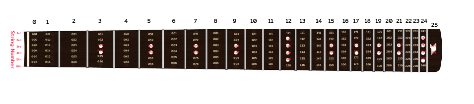

# คู่มือการกำหนด Pattern และการตั้งค่าสีของ Chord สำหรับระบบ LED กีตาร์

## โครงสร้างเอกสาร
- [คู่มือการกำหนด Pattern และการตั้งค่าสีของ Chord สำหรับระบบ LED กีตาร์](#คู่มือการกำหนด-pattern-และการตั้งค่าสีของ-chord-สำหรับระบบ-led-กีตาร์)
  - [โครงสร้างเอกสาร](#โครงสร้างเอกสาร)
  - [1. วิธีการตั้งค่าสีพื้นฐาน](#1-วิธีการตั้งค่าสีพื้นฐาน)
    - [การใช้สีพื้นฐานใน Pattern](#การใช้สีพื้นฐานใน-pattern)
  - [2. วิธีการตั้งค่าสีพื้นฐาน](#2-วิธีการตั้งค่าสีพื้นฐาน)
  - [3. วิธีการกำหนด Pattern สำหรับ Fingerboard Guitar](#3-วิธีการกำหนด-pattern-สำหรับ-fingerboard-guitar)
    - [โครงสร้างพื้นฐานของการกำหนด Pattern สำหรับ Fingerboard](#โครงสร้างพื้นฐานของการกำหนด-pattern-สำหรับ-fingerboard)
    - [ตำแหน่ง LED บน Fingerboard](#ตำแหน่ง-led-บน-fingerboard)
    - [ตัวอย่างการใช้งาน `led_positions` แบบ 1 สี](#ตัวอย่างการใช้งาน-led_positions-แบบ-1-สี)
    - [ตัวอย่างการใช้งาน `led_positions` แบบ 2 สี](#ตัวอย่างการใช้งาน-led_positions-แบบ-2-สี)
  - [4. รูปแบบการตั้งชื่อตัวแปร](#4-รูปแบบการตั้งชื่อตัวแปร)
    - [ตัวอย่างการตั้งชื่อตัวแปร](#ตัวอย่างการตั้งชื่อตัวแปร)
      - [สำหรับ Chord](#สำหรับ-chord)
      - [สำหรับ Scale](#สำหรับ-scale)
    - [ตัวอย่างโค้ดการตั้งชื่อตัวแปรใน `pattern.h`](#ตัวอย่างโค้ดการตั้งชื่อตัวแปรใน-patternh)

---

## 1. วิธีการตั้งค่าสีพื้นฐาน

ในไฟล์ `pattern.h` ได้กำหนดสีพื้นฐานที่สามารถใช้งานได้ทันที โดยสามารถเลือกใช้ได้ตามชื่อตัวแปรที่กำหนดไว้ เช่น `COLOR_RED` สำหรับสีแดง, `COLOR_GREEN` สำหรับสีเขียว และ `COLOR_BLUE` สำหรับสีน้ำเงิน เป็นต้น

| ชื่อสี            | ค่าที่ตั้งไว้ (RGB)     |
| -------------- | ----------------- |
| `COLOR_RED`    | `{255, 0, 0}`     |
| `COLOR_GREEN`  | `{0, 255, 0}`     |
| `COLOR_BLUE`   | `{0, 0, 255}`     |
| `COLOR_YELLOW` | `{255, 255, 0}`   |
| `COLOR_PURPLE` | `{128, 0, 128}`   |
| `COLOR_WHITE`  | `{255, 255, 255}` |

### การใช้สีพื้นฐานใน Pattern
เพียงแค่ใส่ชื่อของตัวแปรสีในฟิลด์ `led_color` ของแต่ละ segment เช่น:
```c
.led_color = COLOR_RED // ใช้สีแดง
```

## 2. วิธีการตั้งค่าสีพื้นฐาน

หากต้องการใช้สีอื่นที่ไม่ใช่สีพื้นฐานที่กำหนดไว้ สามารถสร้างตัวแปรสีใหม่ได้ใน `pattern.h` โดยใช้โครงสร้าง `Color` ตามตัวอย่างนี้:

```c
static const Color COLOR_CYAN = {0, 255, 255}; // สีฟ้าอ่อน
static const Color COLOR_ORANGE = {255, 165, 0}; // สีส้ม
```
หลังจากสร้างสีใหม่เสร็จแล้ว สามารถนำชื่อของตัวแปรสีใหม่นี้ไปใช้ใน Pattern ได้โดยตรง

---
## 3. วิธีการกำหนด Pattern สำหรับ Fingerboard Guitar

Pattern สำหรับ Fingerboard Guitar ช่วยกำหนดตำแหน่งของไฟ LED ที่จะติดบน fingerboard ในแต่ละคอร์ดหรือสเกล โดยแบ่งออกเป็นหลายส่วน (segment) ซึ่งแต่ละ segment สามารถกำหนดได้ดังนี้:

- **`led_positions`**: ตำแหน่งของ LED ที่ต้องการเปิดใน segment นั้น เช่น `{0, 1, 2}`
- **`led_count`**: จำนวนของตำแหน่ง LED ที่ใช้งานใน segment นั้น
- **`led_color`**: สีของ LED ที่จะใช้ใน segment นั้น (เช่น `COLOR_RED`, `COLOR_GREEN`)

### โครงสร้างพื้นฐานของการกำหนด Pattern สำหรับ Fingerboard
สามารถกำหนด Pattern ได้ในไฟล์ `pattern.h` ตามโครงสร้างดังนี้:

```c
static const ChordPattern pattern_example = {
    .segment_count = จำนวน segment,
    .segments = {
        {.led_positions = {ตำแหน่ง LED ใน segment 0}, .led_count = จำนวน LED, .led_color = สีของ segment 0},
        {.led_positions = {ตำแหน่ง LED ใน segment 1}, .led_count = จำนวน LED, .led_color = สีของ segment 1},
        // เพิ่ม segment ตามต้องการ
    }
};
```

### ตำแหน่ง LED บน Fingerboard

ภาพด้านล่างแสดงสำหรับตำแหน่ง `led_positions` บน Fingerboard Guitar โดยใช้ตัวเลขที่ระบุในแต่ละเฟรตและสายกีตาร์ เพื่อระบุตำแหน่งที่ถูกต้องของ `led_positions` ในการตั้งค่า Pattern สำหรับคอร์ดและสเกล



### ตัวอย่างการใช้งาน `led_positions` แบบ 1 สี

ตัวอย่างเช่น หากคุณต้องการให้ไฟ LED สว่างในตำแหน่ง:
- **สายที่ 1 เฟรตที่ 0** (`001`)
- **สายที่ 3 เฟรตที่ 5** (`053`)
- **สายที่ 5 เฟรตที่ 12** (`125`)

คุณสามารถตั้งค่า `led_positions` ใน Pattern ได้ดังนี้:

```c
static const ChordPattern pattern_example = {
    .segment_count = 1,
    .segments = {
        {.led_positions = {1, 53, 125}, .led_count = 3, .led_color = COLOR_RED} // สีแดง
    }
};
```

### ตัวอย่างการใช้งาน `led_positions` แบบ 2 สี

ตัวอย่างเช่น หากคุณต้องการให้ไฟ LED สว่างในตำแหน่ง สีแดง:
- **สายที่ 1 เฟรตที่ 0** (`001`)
- **สายที่ 3 เฟรตที่ 5** (`053`)
- **สายที่ 5 เฟรตที่ 12** (`125`)
ตัวอย่างเช่น หากคุณต้องการให้ไฟ LED สว่างในตำแหน่ง สีขาว:
- **สายที่ 4 เฟรตที่ 0** (`041`)
- **สายที่ 5 เฟรตที่ 5** (`055`)
- **สายที่ 2 เฟรตที่ 12** (`122`)
- **สายที่ 6 เฟรตที่ 22** (`226`)
คุณสามารถตั้งค่า `led_positions` ใน Pattern ได้ดังนี้:

```c
static const ChordPattern pattern_example = {
    .segment_count = 2,
    .segments = {
        {.led_positions = {1, 53, 125}, .led_count = 3, .led_color = COLOR_RED} // สีแดง
        {.led_positions = {41, 55, 122,226}, .led_count = 4, .led_color = COLOR_WHITE} // สีขาว
    }
};
```

## 4. รูปแบบการตั้งชื่อตัวแปร

เพื่อให้การตั้งชื่อตัวแปรของ Pattern เป็นไปอย่างมีระเบียบและง่ายต่อการค้นหา ควรใช้รูปแบบการตั้งชื่อในโครงสร้าง **`A_B_C_D`** ซึ่งมีความหมายดังนี้:

| ตัวอักษร | ความหมาย       | รายละเอียด                                                                            |
| ------ | -------------- | ------------------------------------------------------------------------------------ |
| `A`    | ประเภท (Type)  | `C` สำหรับ Chord, `S` สำหรับ Scale                                                       |
| `B`    | Root Note      | โน้ตหลัก ใช้ตัวอักษรตัวใหญ่ เช่น `C`, `D`, `E`, `F`, `G`, `A`, `B`                           |
| `C`    | Type Note      | ประเภทของคอร์ดหรือสเกล เช่น `MAJ` (Major), `MIN` (Minor), `PENT_MAJ` (Pentatonic Major) |
| `D`    | Pattern Number | หมายเลข Pattern เช่น `1`, `2`                                                         |

### ตัวอย่างการตั้งชื่อตัวแปร

#### สำหรับ Chord
- `C_G_MAJ_1`: คอร์ด G Major, Pattern ที่ 1
- `C_A_MIN_2`: คอร์ด A Minor, Pattern ที่ 2
- `C_C_7_1`: คอร์ด C Dominant 7th, Pattern ที่ 1

#### สำหรับ Scale
- `S_C_PENT_MAJ_1`: สเกล C Pentatonic Major, Pattern ที่ 1
- `S_E_PENT_MIN_2`: สเกล E Pentatonic Minor, Pattern ที่ 2
- `S_B_PENT_MIN_Full`: สเกล B Pentatonic Minor, Pattern ที่ Full

### ตัวอย่างโค้ดการตั้งชื่อตัวแปรใน `pattern.h`

```c
// ตัวอย่างการตั้งชื่อ Chord G Major, Pattern 1
static const ChordPattern C_G_MAJ_1 = {
    .segment_count = 2,
    .segments = {
    }
};

// ตัวอย่างการตั้งชื่อ Scale C Pentatonic Major, Pattern 1
static const ChordPattern S_C_PENT_MAJ_1 = {
    .segment_count = 2,
    .segments = {
    }
};

// ตัวอย่างการตั้งชื่อ Scale C Pentatonic Minor, Pattern Full
static const ChordPattern S_B_PENT_MIN_Full = {
    .segment_count = 2,
    .segments = {
    }
};
```

